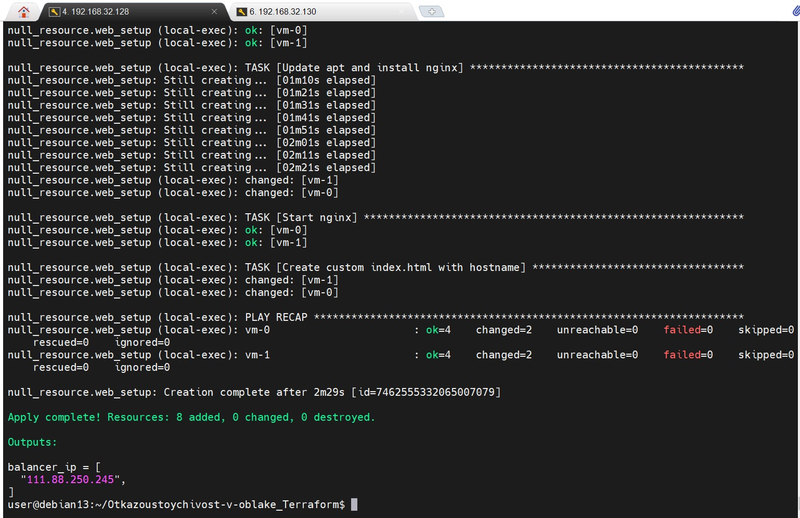
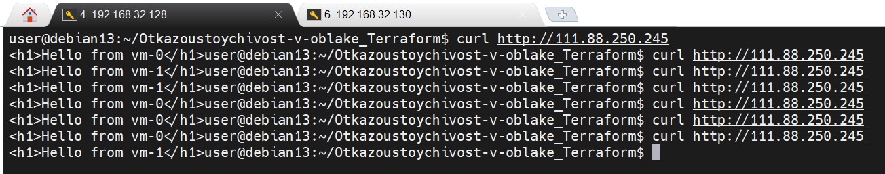
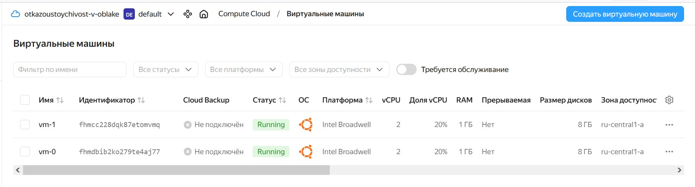
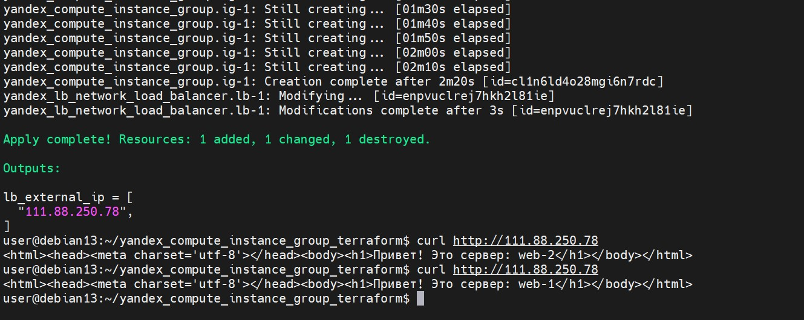
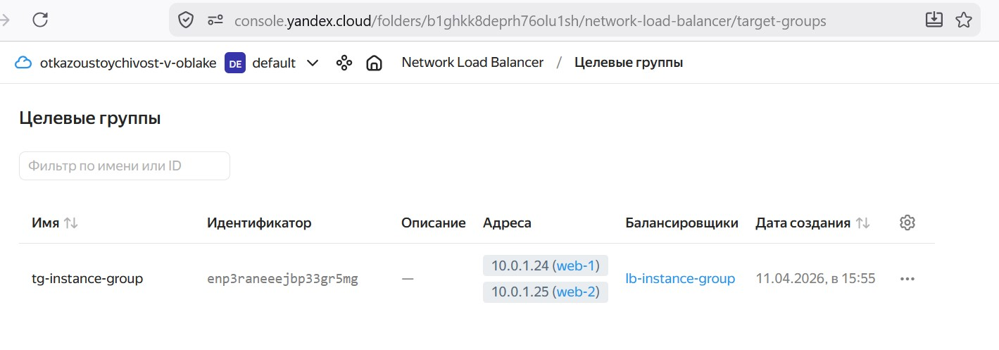
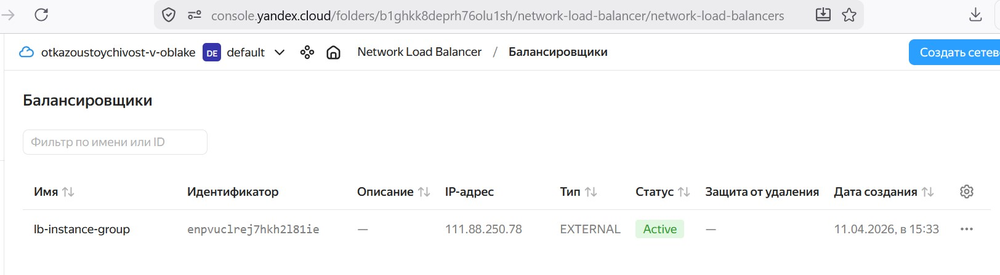

# Домашнее задание к занятию 3 «Резервное копирование» - Бобков Александр
<details>
<summary><b>Задание 1</b></summary>

Возьмите за основу [решение к заданию 1 из занятия «Подъём инфраструктуры в Яндекс Облаке»](https://github.com/netology-code/sdvps-homeworks/blob/main/7-03.md#задание-1).

1. Теперь вместо одной виртуальной машины сделайте terraform playbook, который:

- создаст 2 идентичные виртуальные машины. Используйте аргумент [count](https://www.terraform.io/docs/language/meta-arguments/count.html) для создания таких ресурсов;
- создаст [таргет-группу](https://registry.terraform.io/providers/yandex-cloud/yandex/latest/docs/resources/lb_target_group). Поместите в неё созданные на шаге 1 виртуальные машины;
- создаст [сетевой балансировщик нагрузки](https://registry.terraform.io/providers/yandex-cloud/yandex/latest/docs/resources/lb_network_load_balancer), который слушает на порту 80, отправляет трафик на порт 80 виртуальных машин и http healthcheck на порт 80 виртуальных машин.

Рекомендуем изучить [документацию сетевого балансировщика нагрузки](https://cloud.yandex.ru/docs/network-load-balancer/quickstart) для того, чтобы было понятно, что вы сделали.

2. Установите на созданные виртуальные машины пакет Nginx любым удобным способом и запустите Nginx веб-сервер на порту 80.

3. Перейдите в веб-консоль Yandex Cloud и убедитесь, что: 

- созданный балансировщик находится в статусе Active,
- обе виртуальные машины в целевой группе находятся в состоянии healthy.

4. Сделайте запрос на 80 порт на внешний IP-адрес балансировщика и убедитесь, что вы получаете ответ в виде дефолтной страницы Nginx.

*В качестве результата пришлите:*

*1. Terraform Playbook.*

*2. Скриншот статуса балансировщика и целевой группы.*

*3. Скриншот страницы, которая открылась при запросе IP-адреса балансировщика.*

-----

### ОТВЕТ:

#   План действий (Workflow):

    Написание кода: Создаем 3 файла: main.tf (инфраструктура), hosts.tftpl (шаблон для Ansible) и playbook.yml (настройка Nginx).
    Проверка: terraform plan (смотрим, что создастся 2 ВМ и балансировщик).
    Запуск: terraform apply (Terraform создает облако, создает файл hosts.ini, ждет 60 сек запускает Ansible).

1. Файл `main.tf`

```config

################################################################################
# 1. ПОИСК ОБРАЗА СИСТЕМЫ
################################################################################
# Этот блок автоматически ищет последний актуальный ID образа Ubuntu 22.04.
# Не нужно прописывать ID вручную (типа fd8...), Terraform найдет его сам.
data "yandex_compute_image" "ubuntu" {
  family = "ubuntu-2204-lts"
}
################################################################################
# 2. СЕТЕВАЯ ИНФРАСТРУКТУРА
################################################################################
# Создаем виртуальную сеть (VPC). Виртуальный роутер для нашего проекта.
resource "yandex_vpc_network" "develop" {
  name = "develop"
}

# Создаем подсеть в зоне "ru-central1-a". 
# Все наши ресурсы (ВМ и балансировщик) будут жить внутри этой подсети.
resource "yandex_vpc_subnet" "develop" {
  name           = "develop-ru-central1-a"
  zone           = "ru-central1-a"
  network_id     = yandex_vpc_network.develop.id
  v4_cidr_blocks = ["10.0.1.0/24"] # Внутренние IP будут начинаться на 10.0.1.x
}

################################################################################
# 3. СОЗДАНИЕ ВИРТУАЛЬНЫХ МАШИН
################################################################################
# Используем аргумент count для создания двух одинаковых машин.
resource "yandex_compute_instance" "vm" {
  count = 2 
  name  = "vm-${count.index}" # Имена будут vm-0 и vm-1
  zone  = "ru-central1-a"

  resources {
    cores         = var.test.cores         # Берем кол-во ядер из переменных
    memory        = var.test.memory        # Память из переменных
    core_fraction = var.test.core_fraction # Доля CPU (20% дешевле)
  }

  boot_disk {
    initialize_params {
      image_id = data.yandex_compute_image.ubuntu.id # Тот самый образ, что нашли в начале
    }
  }

  network_interface {
    subnet_id = yandex_vpc_subnet.develop.id
    nat       = true # Включаем внешний IP, чтобы Ansible мог зайти из интернета
  }

  metadata = {
    serial-port-enable = 1 # Включаем консоль (помогает при отладке)
    # Пробрасываем SSH-ключ для пользователя ubuntu
    ssh-keys           = "ubuntu:${file("~/.ssh/id_rsa.pub")}"
  }
}

################################################################################
# 4. ПОДГОТОВКА К ANSIBLE
################################################################################
# Этот ресурс берет шаблон hosts.tftpl и вставляет в него реальные IP-адреса машин.
# На выходе получаем готовый файл hosts.ini.
resource "local_file" "hosts_cfg" {
  content = templatefile("./hosts.tftpl", {
    web_vms = yandex_compute_instance.vm
  })
  filename = "./hosts.ini"
}

# Этот блок запускает сам Ansible после того, как "железо" создано.
resource "null_resource" "web_setup" {
  # Запускаем только когда машины созданы и файл hosts.ini готов
  depends_on = [yandex_compute_instance.vm, local_file.hosts_cfg]

  provisioner "local-exec" {
    # sleep 60 дает машинам время загрузиться, иначе Ansible не достучится по SSH
    command = "sleep 60 && ansible-playbook -i hosts.ini playbook.yml"
  }
}

################################################################################
# 5. БАЛАНСИРОВЩИК (LOAD BALANCER)
################################################################################
# Группируем наши 2 машины в одну "цель" для балансировщика.
resource "yandex_lb_target_group" "tg" {
  name      = "my-target-group"
  region_id = "ru-central1"

  dynamic "target" {
    for_each = yandex_compute_instance.vm # Цикл по всем созданным машинам
    content {
      subnet_id = yandex_vpc_subnet.develop.id
      address   = target.value.network_interface.0.ip_address # Внутренний IP каждой ВМ
    }
  }
}

# Сам балансировщик, который будет принимать трафик снаружи.
resource "yandex_lb_network_load_balancer" "lb" {
  name = "my-load-balancer"

  listener {
    name = "http-listener"
    port = 80 # Какой порт слушаем снаружи
    external_address_spec {
      ip_version = "ipv4"
    }
  }

  attached_target_group {
    target_group_id = yandex_lb_target_group.tg.id

    # Проверка "живы" ли машины. Если Nginx на ВМ упадет, балансировщик уберет ее из списка.
    healthcheck {
      name = "http"
      http_options {
        port = 80
        path = "/"
      }
    }
  }
}

################################################################################
# 6. ВЫВОД РЕЗУЛЬТАТОВ
################################################################################
# Выводим IP балансировщика в консоль, чтобы знать, куда заходить в браузере.
output "balancer_ip" {
  value = flatten([
    for listener in yandex_lb_network_load_balancer.lb.listener :
    [for spec in listener.external_address_spec : spec.address]
  ])
}

```

2. Файл `hosts.tftp`l (Шаблон для Ansible)

```config

[web]
%{ for vm in web_vms ~}
${vm.name} ansible_host=${vm.network_interface.0.nat_ip_address}
%{ endfor ~}

[web:vars]
ansible_user=ubuntu
ansible_ssh_private_key_file=~/.ssh/id_rsa
# Отключаем проверку ключа, чтобы Ansible не спрашивал "yes/no" при первом входе
ansible_ssh_common_args='-o StrictHostKeyChecking=no'

```
3. Файл `playbook.yml` (Инструкция для Ansible)

```config

- name: Install Nginx
  hosts: web # Применить ко всем машинам из группы [web]
  become: true # Запускать команды от имени root (sudo)
  tasks:
    - name: Update apt and install nginx
      apt:
        name: nginx
        state: present
        update_cache: true

    - name: Start nginx
      service:
        name: nginx
        state: started
        enabled: true
    # Записываем имя хоста в главную страницу
    - name: Create custom index.html with hostname
      copy:
        content: "<h1>Hello from {{ inventory_hostname }}</h1>"
        dest: /var/www/html/index.html
        mode: '0644'

```

4. Запускаем создание ресурсов в облаке команда `terraform apply`

<summary>Результат развертывания в облаке</summary>



<summary>Проверка работоспособности балансировщика из консоли</summary>


<summary>Проверка работоспособности балансировщика <hfepth</summary>


<summary>ВМ в облаке <hfepth</summary>


<summary>Балансировщик в облаке <hfepth</summary>


<details>
<summary><b>Для себя</b></summary>
# 🛸 Шпаргалка: Yandex Cloud + Terraform + Ansible

Этот документ содержит описание логики, параметров и команд для развертывания отказоустойчивой инфраструктуры.

---

## 🏗 1. Логика работы (Workflow)
1. **Terraform**: Создает сеть, подсеть, 2 виртуальные машины (через `count`) и балансировщик (LBO).
2. **Inventory**: Terraform автоматически создает файл `hosts.ini`, подставляя туда IP-адреса созданных машин.
3. **Ansible**: Заходит на машины через 60 секунд после их создания и устанавливает Nginx.

---

## 🛠 2. Справочник ресурсов Terraform (Yandex Cloud)


| Ресурс | Описание | Ключевые параметры |
| :--- | :--- | :--- |
| `yandex_vpc_network` | Виртуальная сеть | `name` — имя сети. |
| `yandex_vpc_subnet` | Подсеть проекта | `v4_cidr_blocks` (напр. `10.0.1.0/24`), `zone`. |
| `yandex_compute_instance` | Виртуальная машина | `count` — кол-во ВМ, `nat = true` — дает внешний IP. |
| `yandex_lb_target_group` | Целевая группа | `target` — список внутренних IP-адресов ВМ. |
| `yandex_lb_network_load_balancer` | Балансировщик | `listener` (порт 80), `healthcheck` (проверка связи). |

**Важные настройки метаданных ВМ:**
* `ssh-keys`: Доступ в формате `"user:${file("~/.ssh/id_rsa.pub")}"`.
* `preemptible = true`: Экономия 50% бюджета (прерываемая машина).

---

## 📦 3. Справочник модулей Ansible


| Модуль | Действие | Пример параметров |
| :--- | :--- | :--- |
| **apt** | Установка софта | `name: nginx`, `state: present`, `update_cache: yes`. |
| **service** | Управление службами | `name: nginx`, `state: started`, `enabled: yes`. |
| **copy** | Создание файлов | `content: "Hello"`, `dest: /var/www/html/index.html`. |
| **local-exec** (в TF) | Запуск из консоли | `command: "ansible-playbook -i hosts.ini playbook.yml"`. |

---

## 💻 4. Основные команды терминала (Debian 13)

### Подготовка и запуск
```bash
# 1. Авторизация (токен живет 24 часа)
export YC_TOKEN=$(yc config get token)

# 2. Инициализация (скачивание плагинов)
terraform init -upgrade

# 3. Развертывание (ВМ + Балансировщик + Ansible)
terraform apply -auto-approve

# 4. Удаление (чтобы не тратить деньги)
terraform destroy -auto-approve

</details>

</details>

------
------


<details>
<summary><b>Задание 2</b></summary>

- Написать скрипт и настроить задачу на регулярное резервное копирование домашней директории пользователя с помощью rsync и cron.
- Резервная копия должна быть полностью зеркальной
- Резервная копия должна создаваться раз в день, в системном логе должна появляться запись об успешном или неуспешном выполнении операции
- Резервная копия размещается локально, в директории `/tmp/backup`
- На проверку направить файл crontab и скриншот с результатом работы утилиты.
------

### ОТВЕТ:
### 1. Создание «умного» скрипта резервного копирования
Скрипт поддерживает два режима: интерактивный (запрашивает пути у пользователя) и автоматический (использует значения по умолчанию для cron).

```bash
#!/bin/bash

# Настройки по умолчанию (для работы через cron)
DEFAULT_SOURCE="$HOME/"
DEFAULT_TARGET="/tmp/backup"

# Проверяем, запущен ли скрипт в интерактивном режиме (есть ли терминал)
if [ -t 0 ]; then
    # Режим ручного запуска: спрашиваем пользователя
    echo "--- Интерактивный режим резервного копирования ---"
    
    read -p "Источник [$DEFAULT_SOURCE]: " SOURCE_DIR
    SOURCE_DIR=${SOURCE_DIR:-$DEFAULT_SOURCE} # Если нажать Enter, возьмет значение по умолчанию
    
    read -p "Назначение [$DEFAULT_TARGET]: " TARGET_DIR
    TARGET_DIR=${TARGET_DIR:-$DEFAULT_TARGET}
else
    # Режим cron: используем настройки по умолчанию без вопросов
    SOURCE_DIR=$DEFAULT_SOURCE
    TARGET_DIR=$DEFAULT_TARGET
fi

# Проверка источника
if [ ! -d "$SOURCE_DIR" ]; then
    logger "Backup error: Directory $SOURCE_DIR not found"
    exit 1
fi

# Создание папки назначения
mkdir -p "$TARGET_DIR"

# Запуск зеркалирования
if rsync -av --delete --checksum --exclude='.*/' "$SOURCE_DIR" "$TARGET_DIR"; then
    logger "Backup successful: $SOURCE_DIR to $TARGET_DIR"
else
    logger "Backup failed: $SOURCE_DIR to $TARGET_DIR"
fi
```

### 2. Настройка прав и планировщика cron

Чтобы скрипт запускался ежедневно в 03:00, необходимо выполнить следующее:

1. `chmod +x backup.sh` (сделать исполняемым).
2. `crontab -e` и добавьте строку:

```config
0 3 * * * /bin/bash /home/$(whoami)/Rezervnoye-kopirovaniye_backup/backup.sh
```

### 3. Проверка работоспособности

- Для проверки поставил в cron выполнение каждую минуту
<summary>Настройка cron</summary>


- Для просмотра лога журналов через journalctl в консоли:

```config
journalctl | grep "Backup" | tail -n 5
```
<summary>Просмотр содержимого `/tmp` и логов через journalctl</summary>


</details>

-------
-------

<details>
<summary><c>Задание 3*</c></summary>

- Настройте ограничение на используемую пропускную способность rsync до 1 Мбит/c
- Проверьте настройку, синхронизируя большой файл между двумя серверами
- На проверку направьте команду и результат ее выполнения в виде скриншота
-------

### ОТВЕТ:


### 1. Для ограничения скорости в rsync используется специальный флаг `--bwlimit`
(В параметре --bwlimit значение указывается в Кибибайтах в секунду)

- Команда для синхронизации файла будет иметь следующий вид:

```config
rsync -av --progress --bwlimit=125 /путь/к/большому_файлу пользователь@удаленный_хост:/tmp/backup/
```

```
Используемые "ключи":

--bwlimit=125: ограничивает скорость передачи до ~1 Мбит/с.
--progress: покажет текущую скорость передачи в реальном времени.
-a: архивный режим (сохранение прав).
-v: подробный вывод.
```

### 2. Создадим большой файл 100MБ:

```config
dd if=/dev/zero of=test_big_file.img bs=1M count=100
```

### 3. Проверим работоспособность команды.

```bash
rsync -av --progress --bwlimit=125 /home/user/test_file.img  user@192.168.32.130:/tmp/backup/
```
<summary>Результат выполнения команды</summary>


<summary>Смотрим размер файла на втором сервере после завершения синхронизации</summary>


</details>

------
------


<details>
<summary><c>Задание 4*</c></summary>

- Напишите скрипт, который будет производить инкрементное резервное копирование домашней директории пользователя с помощью rsync на другой сервер
- Скрипт должен удалять старые резервные копии (сохранять только последние 5 штук)
- Напишите скрипт управления резервными копиями, в нем можно выбрать резервную копию и данные восстановятся к состоянию на момент создания данной резервной копии.
- На проверку направьте скрипт и скриншоты, демонстрирующие его работу в различных сценариях.

------
### ОТВЕТ:

## 1.  Для решения задачи по инкрементному копированию  будем использовать механизм hard links в rsync (флаг --link-dest). Это позволяет каждой копии выглядеть как полная, но занимать место только для измененных файлов.

- Сам скрипт:

```bash
#!/bin/bash

# --- НАСТРОЙКИ ---
SOURCE="$HOME/"
REMOTE_USER="user" # Под каким пользователем
REMOTE_HOST="192.168.32.130"  # IP принимающей стороны
BACKUP_ROOT="/tmp/backups"
TIMESTAMP=$(date +%Y-%m-%d_%H-%M-%S)
CURRENT_BACKUP="$BACKUP_ROOT/$TIMESTAMP"
LATEST_LINK="$BACKUP_ROOT/latest"

echo "--- Старт инкрементного бэкапа: $TIMESTAMP ---"

# 1. Подготовка структуры на сервере
ssh $REMOTE_USER@$REMOTE_HOST "mkdir -p $BACKUP_ROOT"

# 2. Запуск rsync
# Ссылка ../latest ищется относительно создаваемой папки бэкапа
if rsync -avz --delete --exclude='.*/' \
      --link-dest="../latest" \
      "$SOURCE" "$REMOTE_USER@$REMOTE_HOST:$CURRENT_BACKUP"; then
    
    echo "[OK] Данные переданы успешно."
    
    # 3. Обновление ссылки и ротация через алфавитную сортировку
    ssh $REMOTE_USER@$REMOTE_HOST "
        cd $BACKUP_ROOT
        
        # Находим самую новую папку (последняя в алфавитном списке)
        ACTUAL_NEWEST=\$(ls -1 | grep '^20' | sort | tail -n 1)
        
        if [ -n \"\$ACTUAL_NEWEST\" ]; then
            ln -snf \"\$ACTUAL_NEWEST\" latest
            echo \"Ссылка latest теперь указывает на: \$ACTUAL_NEWEST\"
        fi
        
        # Ротация: сортируем от новых к старым и удаляем всё после 5-й
        OLD_BACKUPS=\$(ls -1 | grep '^20' | sort -r | tail -n +6)
        
        if [ -n \"\$OLD_BACKUPS\" ]; then
            echo \"Удаляю лишние копии: \$OLD_BACKUPS\"
            rm -rf \$OLD_BACKUPS
        else
            echo \"В хранилище 5 или менее копий. Удаление не требуется.\"
        fi
    "
else
    echo "[ERROR] Ошибка rsync! Ссылка latest не обновлена."
    exit 1
fi

echo "--- Завершено ---"

```
* **Отработка скрипта**

<summary>Результат отработки скрипта</summary>


<summary>Ротация на принимающем сервере</summary>


## 2. Cкрипт управления резервными копиями/

```bash
#!/bin/bash

# --- НАСТРОЙКИ (должны совпадать с backup.sh) ---
REMOTE_USER="user"  #Под кем запускать
REMOTE_HOST="192.168.32.130"  # IP сервера на котором копия
BACKUP_ROOT="/tmp/backups"
RESTORE_PATH="$HOME/restored_data"

echo "=== Мастер восстановления данных ==="

# 1. Получаем список бэкапов, отсортированный от новых к старым
echo "Запрос списка копий с сервера..."
BACKUPS=$(ssh $REMOTE_USER@$REMOTE_HOST "ls -1 $BACKUP_ROOT | grep '^20' | sort -r")

if [ -z "$BACKUPS" ]; then
    echo "Ошибка: Резервные копии не найдены в $BACKUP_ROOT"
    exit 1
fi

# 2. Интерактивное меню
echo "Выберите копию для восстановления (1 — самая свежая):"
PS3="Введите номер: "

select SELECTED_BACKUP in $BACKUPS; do
    if [ -n "$SELECTED_BACKUP" ]; then
        echo "--> Выбрана точка: $SELECTED_BACKUP"
        
        # Подготовка локальной папки
        echo "Подготовка папки $RESTORE_PATH..."
        [ -d "$RESTORE_PATH" ] && rm -rf "$RESTORE_PATH"
        mkdir -p "$RESTORE_PATH"
        
        # 3. Копирование данных обратно с сервера
        echo "Начинаю загрузку данных..."
        if rsync -avz "$REMOTE_USER@$REMOTE_HOST:$BACKUP_ROOT/$SELECTED_BACKUP/" "$RESTORE_PATH/"; then
            echo "=== Успех! Данные восстановлены в: $RESTORE_PATH ==="
        else
            echo "!!! Произошла ошибка при передаче данных через rsync."
        fi
        break
    else
        echo "Неверный выбор. Пожалуйста, введите число из списка."
    fi
done

```
* **Отработка скрипта восстановления**

<summary>Результат отработки скрипта восстановления</summary>



<summary>Смотрим что данные восстановились</summary>


</details>

